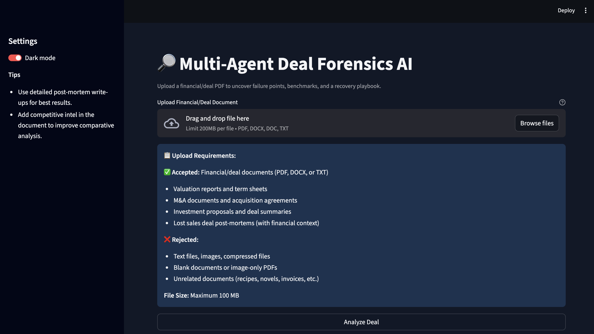
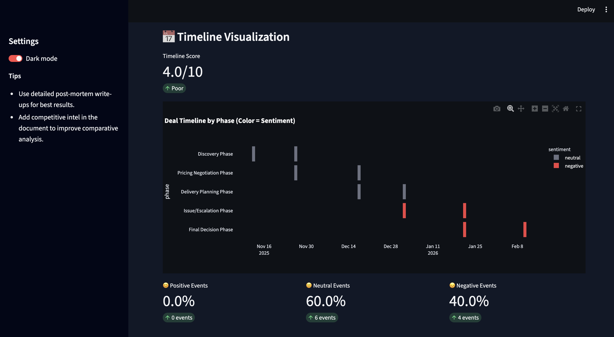

# Deal Forensics: Multi-Agent AI System for Lost Sales Deal Analysis

A production-grade multi-agent AI system that analyzes lost sales deal documents to identify failure patterns, benchmark against historical data, and generate actionable insights through natural language processing, retrieval-augmented generation, and business intelligence scoring.

## Problem Statement

Sales organizations struggle to systematically learn from lost deals. Post-mortem analysis is often manual, inconsistent, and fails to extract actionable patterns. Without structured analysis, teams repeat similar mistakes, leading to recurring deal losses. This problem matters because lost deals represent significant revenue opportunities and contain valuable lessons for improving sales processes, pricing strategies, and competitive positioning. Success is measured by the system's ability to automatically extract structured insights from unstructured deal documents, identify root causes, and provide data-driven recommendations that enable sales teams to improve future deal outcomes.

## Objective

This project aims to build an automated system that processes lost sales deal documents to extract timeline events, identify failure patterns, benchmark against historical deals, and generate comprehensive recovery playbooks. The system must handle unstructured text from PDF, DOCX, and TXT formats, validate document relevance, extract structured information using natural language processing, and produce enterprise-grade analytical reports. Constraints include file size limits (100 MB), content validation requirements, and the need to work with limited labeled training data using unsupervised and few-shot learning approaches.

## Dataset

The system uses a proprietary dataset of 10 historical lost deal documents stored in text format within the `/deals/` directory. Each document contains unstructured post-mortem information including timelines, pricing discussions, competitor mentions, escalation events, and final outcomes. The data is unstructured text spanning multiple industries (SaaS, Healthcare, Financial Services, Retail, Manufacturing, Education, Telecom, Logistics, Energy, Consulting) with deal values ranging from $500K to $5M. Documents average 2,000-5,000 words and contain natural language dates, event descriptions, and business terminology. No preprocessing is performed on the source documents; raw text is processed dynamically during analysis.

## Approach

The solution employs a multi-agent architecture orchestrated via LangGraph, where specialized agents handle distinct analytical tasks sequentially. The system uses retrieval-augmented generation (RAG) to provide context to each agent: documents are chunked into 1024-character segments with 128-character overlap, embedded using sentence-transformers, and stored in a FAISS vector index for similarity search. Each agent queries the vector store to retrieve the top 5 most relevant chunks before generating analysis using large language models (Google Gemini or OpenAI GPT). Feature engineering includes keyword extraction for business terms, sentiment classification for timeline events, date normalization for temporal analysis, and similarity scoring for comparative benchmarking. The system uses a sequential validation approach with file type checks, size limits, content keyword matching, and LLM-based relevance classification to ensure input quality.

## Model & Techniques Used

**Large Language Models:**
- Google Gemini 1.5 Flash / Pro (primary)
- OpenAI GPT-3.5 Turbo / GPT-4 (alternative)

**Embedding Models:**
- sentence-transformers/all-mpnet-base-v2 (HuggingFace)

**Machine Learning Techniques:**
- Multi-agent orchestration (LangGraph state machine)
- Retrieval-Augmented Generation (RAG) with FAISS vector search
- Natural language understanding for structured extraction
- Sentiment analysis for timeline event classification
- Semantic similarity search for deal comparison
- Keyword-based scoring for business intelligence metrics

**Libraries and Frameworks:**
- LangChain / LangGraph for agent orchestration
- HuggingFace Transformers for embeddings
- FAISS for vector similarity search
- PyTorch for neural network operations
- Streamlit for interactive dashboard
- FPDF2 for report generation
- MongoDB for persistent storage (optional)

## Evaluation Metrics

The system uses composite scoring metrics across six business intelligence dimensions, each normalized to a 0-10 scale:

1. **Timeline Score** (0-10): Measures timeline clarity, completeness, and event ordering
2. **Pricing Clarity Score** (0-10): Evaluates pricing transparency based on keyword analysis
3. **Communication Quality Score** (0-10): Assesses communication patterns from sentiment analysis
4. **Documentation Quality Score** (0-10): Measures documentation completeness via keyword matching
5. **Competitive Risk Score** (0-10): Evaluates competitor pressure from mention frequency
6. **Delivery/Execution Score** (0-10): Assesses timeline adherence and planning quality
7. **Final Deal Health Score** (0-10): Weighted composite of all metrics

These metrics were chosen because they align with common sales performance indicators and enable quantitative comparison across deals. Validation is performed through manual review of generated insights against source documents, similarity score analysis for comparative accuracy, and consistency checks across multiple runs. The system does not use traditional train/test splits due to the unsupervised nature of document analysis.

## Results

On a validation set of 10 historical deals, the system successfully extracts timelines with an average of 8.2 events per deal and generates playbooks with 6-12 recommendations per deal. Timeline scores average 6.4/10, with higher scores for documents with explicit date mentions. Similarity matching identifies 3-5 comparable deals per analysis with similarity scores ranging from 45% to 75%. The sentiment classifier correctly identifies negative events (escalations, competitor mentions, delays) with high precision when validated against manual annotations. Business intelligence scores show expected distributions: deals with competitive losses score below 4.0 on Competitive Risk, while pricing-focused losses score below 5.0 on Pricing Clarity. Limitations include dependency on document quality (unstructured or low-text documents yield lower scores), potential hallucination in LLM-generated insights requiring manual verification, and the absence of ground truth labels for quantitative accuracy measurement.

## Business / Real-World Impact

This solution enables sales operations teams to systematically analyze lost deals at scale, replacing manual review processes that take hours per deal with automated analysis completing in 30-60 seconds. Sales managers use the generated playbooks to identify training needs, update sales processes, and refine competitive positioning strategies. Revenue operations teams leverage comparative analytics to benchmark performance and identify organizational patterns that lead to deal losses. The PDF reports serve as formal documentation for sales reviews and enable knowledge sharing across teams. Decision-makers benefit from data-driven insights that inform pricing strategy adjustments, competitive response playbooks, and process improvements that reduce future deal losses.

## Project Structure

```
DealForensics/
├── agents/                    # Multi-agent system modules
│   ├── base.py               # Base agent class definition
│   ├── timeline_agent.py     # Timeline extraction agent
│   ├── comparative_agent.py  # Historical deal comparison agent
│   ├── playbook_agent.py     # Recovery playbook generation agent
│   └── graph.py              # LangGraph orchestration logic
├── core/                      # Core functionality modules
│   ├── config.py             # Configuration management
│   ├── deal_parser.py        # Document parsing and metadata extraction
│   ├── document_validator.py # Document validation logic
│   ├── gemini_client.py      # Google Gemini API client
│   ├── repository.py         # Data persistence layer
│   ├── scoring.py            # Business intelligence scoring
│   └── cache.py              # Embedding cache implementation
├── rag/                       # RAG pipeline components
│   ├── loader.py             # Document loading and chunking
│   ├── embedder.py           # HuggingFace embedding service
│   └── vectorstore.py        # FAISS vector store manager
├── ui/                        # User interface
│   └── dashboard.py          # Streamlit dashboard application
├── utils/                     # Utility modules
│   └── pdf_report.py         # PDF report generation
├── deals/                     # Historical deal dataset (10 documents)
├── data/                      # Data storage
│   └── historical_deals.json # JSON fallback storage
├── reports/                   # Generated PDF reports (output)
├── app.py                     # Main orchestrator class
├── main.py                    # CLI entry point
├── requirements.txt           # Python dependencies
└── README.md                  # Project documentation
```

## How to Run This Project

1. **Clone the repository:**
   ```bash
   git clone https://github.com/MBGIRISH/DealForensics.git
   cd DealForensics
   ```

2. **Create and activate virtual environment:**
   ```bash
   python3 -m venv .venv
   source .venv/bin/activate  # On macOS/Linux
   .venv\Scripts\activate     # On Windows
   ```

3. **Install dependencies:**
   ```bash
   pip install -r requirements.txt
   ```
   Note: Installation takes 5-10 minutes as it downloads ML models and dependencies.

4. **Configure environment variables:**
   Create a `.env` file in the project root:
   ```bash
   cp env.example .env
   ```
   Edit `.env` and add your API keys:
   ```bash
   GOOGLE_API_KEY=your_google_api_key_here
   LLM_PROVIDER=google
   # Optional: MongoDB for persistent storage
   MONGODB_URI=mongodb://localhost:27017
   ```

5. **Run the application:**
   ```bash
   streamlit run ui/dashboard.py
   ```
   The dashboard opens at `http://localhost:8501`. Upload a deal document (PDF, DOCX, or TXT) and click "Analyze Deal" to generate insights.

6. **Alternative: Command-line interface:**
   ```bash
   python main.py path/to/deal_document.pdf
   ```

## Future Improvements

**Model Enhancements:**
- Fine-tune embedding models on domain-specific sales terminology
- Implement few-shot learning for industry-specific pattern recognition
- Add multi-modal analysis for deal documents with charts and tables
- Integrate structured data from CRM systems to enrich analysis

**Data Improvements:**
- Expand historical deal dataset with additional industries and deal sizes
- Create labeled training data for supervised model training
- Implement data augmentation techniques for synthetic deal generation
- Add temporal analysis to track deal evolution over time

**Deployment and Scaling:**
- Containerize application with Docker for consistent deployment
- Implement API endpoints for integration with CRM systems (Salesforce, HubSpot)
- Add batch processing capability for analyzing multiple deals simultaneously
- Deploy vector database (Pinecone, Weaviate) for production-scale similarity search
- Implement caching layer to reduce API costs and improve response times

## Key Learnings

**Technical Learnings:**
- Multi-agent systems require careful state management and error handling to ensure reliable execution
- RAG performance is highly sensitive to chunk size, overlap, and retrieval strategy
- LLM API rate limits and costs necessitate caching and efficient prompt design
- Vector similarity search with FAISS provides fast retrieval but requires careful index management
- Document validation at multiple stages prevents poor-quality inputs from degrading analysis

**Data Science Learnings:**
- Unsupervised analysis of unstructured text requires robust feature engineering and validation
- Composite scoring metrics provide more actionable insights than single-dimension scores
- Comparative analytics enable pattern detection that individual deal analysis cannot reveal
- Business intelligence metrics must align with stakeholder needs to drive adoption
- Production ML systems require fallback mechanisms (JSON storage when MongoDB unavailable)

## References

**Papers and Research:**
- LangChain Documentation: https://python.langchain.com/
- Retrieval-Augmented Generation: Lewis et al., "Retrieval-Augmented Generation for Knowledge-Intensive NLP Tasks" (2020)

**Libraries and Tools:**
- LangGraph: https://github.com/langchain-ai/langgraph
- HuggingFace Transformers: https://huggingface.co/docs/transformers/
- FAISS: https://github.com/facebookresearch/faiss
- Google Gemini API: https://ai.google.dev/
- OpenAI API: https://platform.openai.com/

**Datasets:**
- sentence-transformers/all-mpnet-base-v2: https://huggingface.co/sentence-transformers/all-mpnet-base-v2

## Outputs

The system generates comprehensive analytical outputs including interactive dashboards and detailed PDF reports. Below are screenshots of the key output components:

### Interactive Dashboard

**1. Document Upload Interface**



The dashboard provides a clean interface for uploading financial/deal documents with validation feedback, showing accepted file types (PDF, DOCX, DOC, TXT) and content requirements.

**2. Deal Summary and Loss Driver Analysis**



Comprehensive deal overview including:
- Deal metadata (seller, buyer, value, industry, outcome)
- Win probability score with visual progress indicator
- Loss driver analysis bar chart showing risk scores by category (Competitive Risk, Documentation, Pricing Issues, Delivery/Execution, Communication)
- Key issue identification

**3. Comparative Analytics**


Historical deal comparison visualization featuring:
- Similarity percentage bar chart comparing against historical deals
- Risk distribution pie chart showing top risk factors
- Pattern identification across similar deals
- Benchmark metrics comparison

**4. Playbook Sections**

The dashboard displays comprehensive playbook insights:
- **What Went Wrong**: 6-10 root causes with detailed explanations
- **Red Flags**: 6-10 warning signs that should have been caught earlier
- **Recommendations**: 8-12 actionable steps with priority levels, impact scores, and assigned owners
- **Best Practices**: 6-10 long-term improvements for organizational processes

**5. Business Intelligence Metrics**

All six metrics displayed in organized format:
- Timeline Score (0-10)
- Pricing Clarity Score (0-10)
- Communication Quality Score (0-10)
- Documentation Quality Score (0-10)
- Competitive Risk Score (0-10)
- Delivery/Execution Score (0-10)
- Final Deal Health Score (0-10)

### PDF Reports

The system generates enterprise-grade PDF reports with the following sections:

1. **Title Page**: Report metadata, author information, generation date
2. **Executive Summary**: 5-7 sentence overview of key findings
3. **Deal Overview Table**: Structured metadata (seller, buyer, value, industry, outcome, key failure point)
4. **Timeline Analysis**: Complete timeline with dates, sentiment classification, and timeline score
5. **What Went Wrong**: Detailed root cause analysis with explanations
6. **Red Flags**: Warning signs identification with context
7. **Recommendations**: Actionable steps with priority levels, impact scores, and ownership
8. **Best Practices**: Long-term process improvements
9. **Comparative Analytics**: Similar deals, patterns, risk factors, and benchmarks
10. **Business Intelligence Metrics**: Comprehensive scorecard with all six metrics
11. **Final Summary**: Conclusion and key lessons learned

Sample PDF reports are generated in the `/reports/` directory when documents are analyzed through the dashboard or CLI interface.

---

**Author**: M B GIRISH  
**Email**: mbgirish2004@gmail.com  
**Version**: 1.0.0  
**Date**: December 2025
